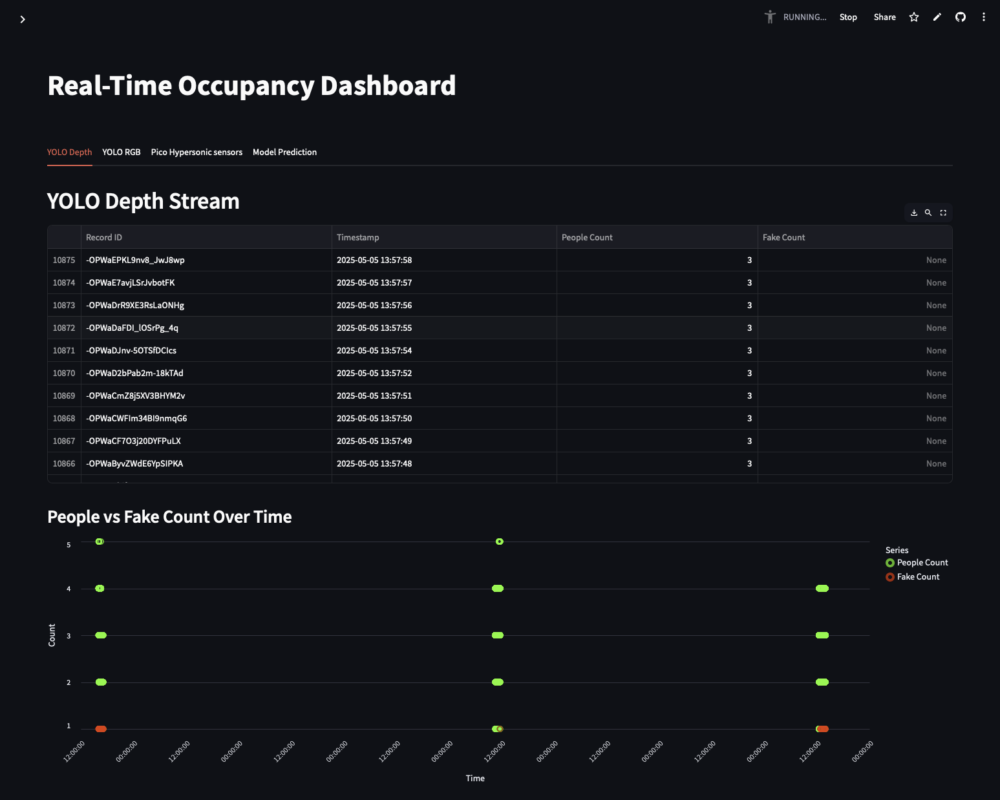
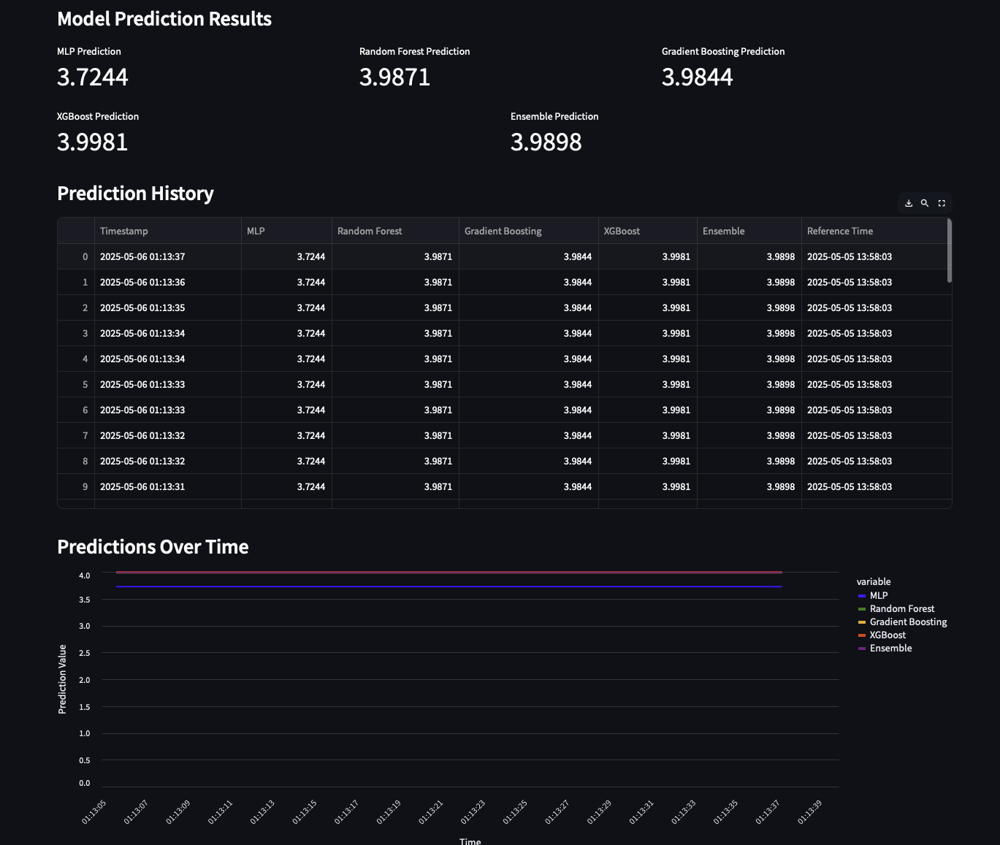
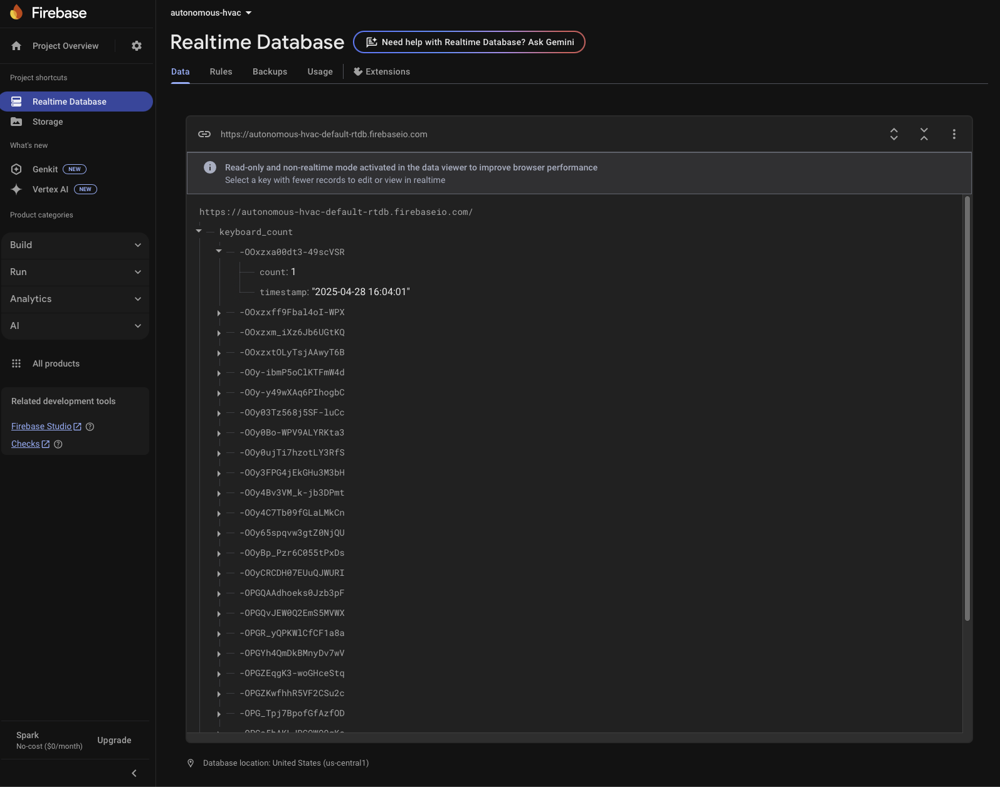
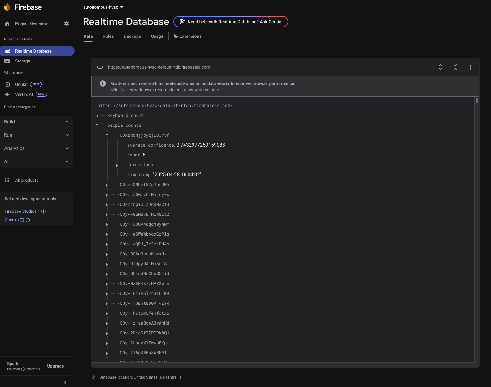
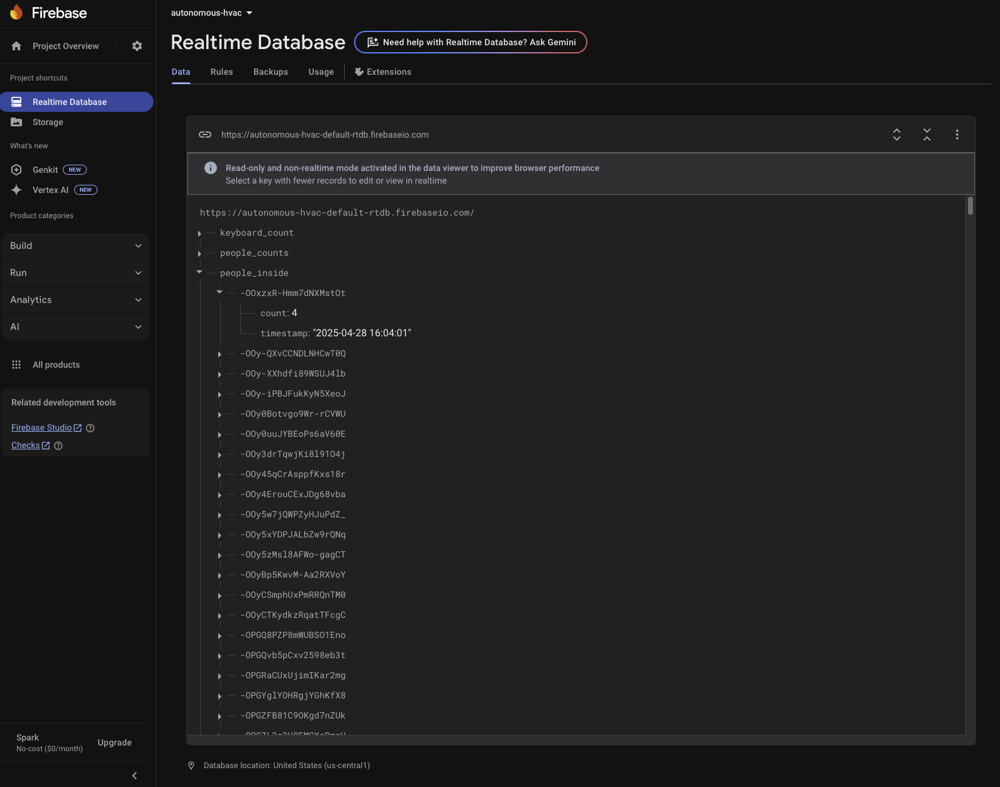
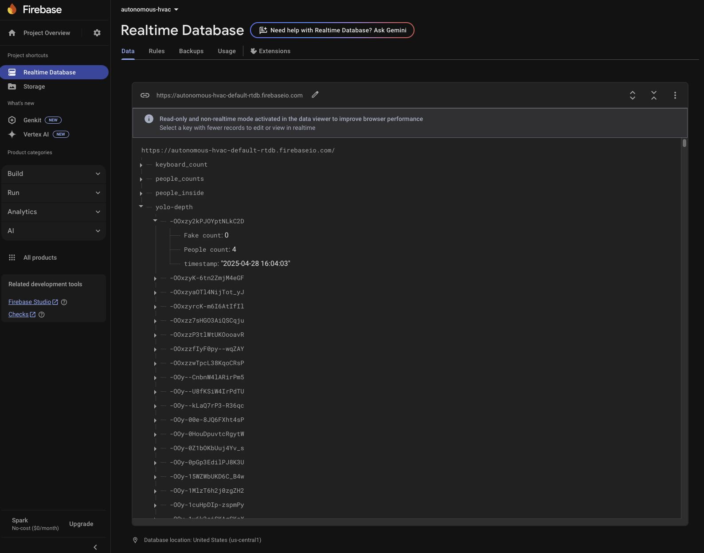

# Introduction
Heating, ventilation, and air conditioning (HVAC) systems in commercial buildings often operate on static schedules that do not reflect real-time occupancy, leading to substantial energy waste. This project addresses the critical need for dynamic HVAC control by proposing an innovative solution that predicts room occupancy using machine learning. By integrating camera-based occupancy detection with a recurrent neural network (RNN), our approach forecasts occupancy trends to intelligently adjust HVAC settings, ensuring comfortable conditions only during periods of actual use. This predictive method fills a notable gap in current reactive HVAC systems, which struggle to adapt promptly to occupancy fluctuations and incur unnecessary energy costs. Validation through a thermodynamic simulation and real-world data demonstrates the potential for significant energy savings without compromising occupant comfort, offering a promising advancement in sustainable building management.

# Dashboard User interface 

# Prediction tab

# Firebase realtime database - Ground Truth sample

# Firebase realtime database - RGB sample

# Firebase realtime database - Pico sample

# Firebase realtime database - RealSense Depth sample

# Section III: Plan for Completion of the Project  

Below is a table outlining the plan for project completion, including milestones and dates. Milestones highlighted in gray are those with class due dates or confirmed scheduling with at least one class instructor.  

# **Project Milestone Schedule**  

| Description | Completion Date | Status |
|------------|----------------|--------|
| **Project Proposal** | **2/25/25** | 100% Completed |
| **Receive Initial Sensing Kit** | **3/25/25** | 100% Completed |
| **Project Update Due** | **4/3/25** | 100% Completed |
| **Order and Receive Any Additional Sensors Required** | **4/4/25** | 100% Completed |
| **First Scheduled Group Office Hour/Project Update** | **4/10/25** | 100% Completed |
| **Sensing Hardware Ready for Deployment** | **4/12/25** | 100% Completed |
| **Begin Sensor Deployment/Data Collection** | **4/15/25** | 100% Completed |
| **End Sensor Deployment/Data Collection** | **4/18/25** | 100% Completed |
| **Train Model and Complete Simulation** | **4/21/25** | 100% Completed |
| **Develop Initial Project Demonstration** | **4/21/25** | 100% Completed |
| **Second Scheduled Group Office Hour/Project Update** | **4/22/25** | 100% Completed |
| **Finalize Project Demonstration** | **4/23/25** | 100% Completed |
| **Project Demonstration Event** | **4/25/25** | 100% Completed |
| **Project Report Due** | **5/5/25** | 100% Completed |

